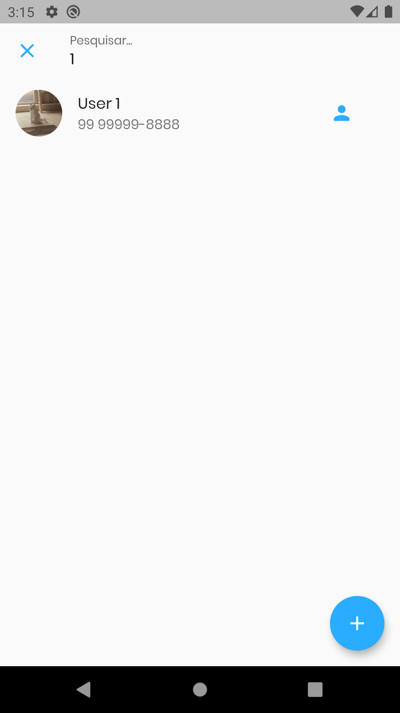

# Flutter Contacts

> Projeto de Gerenciamento de Contatos desenvolvido com Flutter utilizando arquitetura MVC e MVVM com os recursos de Biometria, Câmera, GPS, Google Maps e SQLite.

## Project

    
    

    
    

    
    

